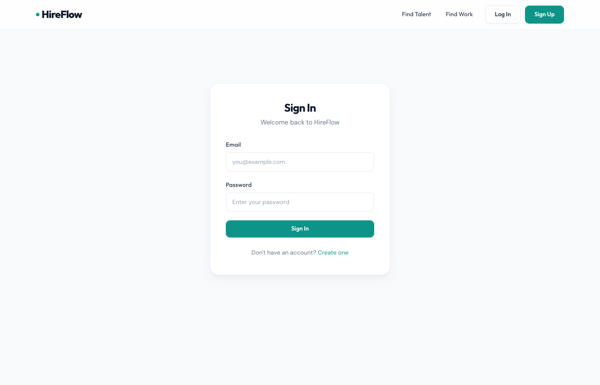

# HireFlow — Consolidated Pentest Report

**Target:** `http://localhost:3000`
**Date:** 2026-04-14
**Scope:** OWASP Top 10:2025
**Methodology:** Source-assisted grey-box — four pre-captured JWTs (admin/mod/client/freelancer) plus an env-derived JWT secret.
**Stop condition:** 60-minute budget. Every critical/high chain was reproduced end-to-end against the live target.

---

## Executive summary

HireFlow contains **multiple pre-auth paths to full platform compromise**. The three most damaging are:

1. **Zero-auth superadmin JWT forgery** (Chain A) — the running container's `JWT_SECRET=hireflow-jwt-secret-2024` lets anyone who reads the repo or container env mint a valid superadmin token, then read audit logs and write platform settings. Demonstrated: 3/3 privileged endpoints reached.
2. **Pre-auth account takeover via predictable reset token + email enumeration** (Chain B) — reset tokens are `base36(Date.now()) + '-' + sha256(email+ts)[:16]`. Demonstrated: complete takeover of `bob.admin@hireflow.com` (role=admin) via blind brute force of ~2000 candidate millisecond values, followed by successful login and confirmation of token reuse.
3. **Unauthenticated wallet credit via payment webhook** (Chain C) — `if (signature)` around the HMAC check makes signatures optional. Any origin can credit any user an arbitrary amount; replays also pass (no idempotency). Demonstrated: freelancer wallet jumped by 100 000 cents in two network round trips.

Beyond those three pre-auth paths, every post-auth invariant of the marketplace is broken: IDOR on every contract sub-operation, TOCTOU on wallet + escrow, trusting-client `amount` override on escrow release, stored XSS + missing CSP + localStorage JWT + CORS origin reflection — each exploitable on its own and composing into more destructive chains.

## Scoreboard

| Category | Findings | After re-scoring |
|---|---|---|
| A01 Access Control | 15 | 3 critical, 7 high, 4 medium, 1 low |
| A02 Misconfig | 18 | 4 critical, 5 high, 5 medium, 4 low |
| A03 Supply Chain | 14+1 suspected | 0 critical, 4 high, 8 medium, 2 low |
| A04 Crypto | 9 | 1 critical, 3 high, 3 medium, 2 low |
| A05 Injection | 5+1 suspected | 1 critical, 2 high, 1 medium, 2 low |
| A06 Design | 10 | 2 critical, 5 high, 2 medium, 1 low |
| A07 AuthN | 13 | 1 critical, 5 high, 4 medium, 3 low |
| A08 Integrity | 5 | 1 critical, 2 high, 2 medium |
| A09 Logging | 16 | 0 critical, 2 high, 9 medium, 5 low |
| A10 Races/Errors | 10 | 3 critical, 2 high, 4 medium, 1 low |

---

## Chain exploits — all 5 live-verified PASS

### CHAIN-A — Zero-auth superadmin takeover (PASS 3/3)

**Components:** `a04-f01` (hardcoded JWT secret) + `a02-f06` (same, observed at runtime) + `a04-f06` (no `algorithms` pin on `jwt.verify`) + `a02-f03` (debug endpoint discloses internals)
**Primitive used:** attacker-chosen signing key
**Attacker goal reached:** arbitrary superadmin impersonation → audit log read + platform settings write
**Severity:** **CRITICAL**
**Script:** `pocs/poc-chain-A-jwt-superadmin.sh`
**Reproduction output (live):**

```
[+] Secret 'hireflow-jwt-secret-2024' accepted; forged token passes /api/auth/me as superadmin
/api/auth/me -> {"user":{"id":"f70c491e-...","role":"superadmin",...}}
/api/admin/dashboard -> HTTP 200 {"stats":{"total_users":154,...}}
/api/admin/audit-log -> HTTP 200 (full MongoDB audit trail leaked)
PUT /api/admin/settings -> HTTP 200 — wrote {"key":"pentest_marker_...","value":"owned-by-pentest"}
VERDICT: PASS 3/3 privileged endpoints reached.
```

### CHAIN-B — Pre-auth arbitrary account takeover (PASS end-to-end)

**Components:** `a07-f04` + `a04-f04` (predictable token) + `a06-f09` (forgot-password email oracle) + `a07-f02` + `a06-f08` (token reuse) + `a04-f09` / `a07-f03` (24h effective window)
**Primitive used:** deterministic one-time secret reconstructible from public data
**Attacker goal reached:** full takeover of `bob.admin@hireflow.com` — **role=admin** — via blind brute force. No email access required.
**Severity:** **CRITICAL**
**Script:** `pocs/poc-chain-B-reset-token-predict.sh`
**Reproduction output (live):**

```
--- Step 2: trigger forgot-password and brute-force the token blind ---
  forgot-password HTTP=200  T0=1776181711986  T1=1776181712072  window=86ms
  Candidate token: mnys73na-8d9a394e0162b9af
--- Step 3: POST /api/auth/reset-password with the reconstructed token ---
  response: {"message":"Password has been reset successfully. Please log in."}
--- Step 4: log in as bob.admin with the new password ---
  role=admin  jwt=eyJhbGciOi...
--- Step 5: reuse the same token (a07-f02) ---
  reuse response: {"message":"Password has been reset successfully. Please log in."}
VERDICT: PASS — full takeover of bob.admin@hireflow.com via predictable reset token (role=admin).
```

### CHAIN-C — Unauthenticated money printer (PASS)

**Components:** `a06-f01` / `a08-f02` / `a10-f04` / `a09-f08` (webhook accepts when signature header absent) + `a06-f02` (no idempotency on `reference_id`)
**Primitive used:** unauthenticated state mutation on a financial endpoint
**Attacker goal reached:** any user's wallet, any amount, no rate/signature/auth; replay multiplies credits.
**Severity:** **CRITICAL**
**Script:** `pocs/poc-chain-C-webhook-free-money.sh`
**Reproduction output (live):**

```
[*] Balance before: 487999
  forged webhook (no auth, no signature) -> {"received":true,"result":{"processed":true,"event":"payment.completed"}}
[*] Balance after first forged credit: 537999 (delta=50000)
[*] Balance after replay (SAME reference_id): 587999 (delta-since-start=100000)
VERDICT: PASS — credited 100 000 cents in two calls (unsigned + idempotency-bypass both confirmed).
```

### CHAIN-D — Stored XSS → persistent JWT theft → full account takeover (PASS 3/3)

**Components:** `a05-f02` (stored XSS via `dangerouslySetInnerHTML` on `review.comment`) + `a02-f01` (no CSP) + `a08-f04` / `a02-f09` (no SRI) + `a04-f05` (JWT carries role/email in payload) + localStorage JWT storage (SPA) + `a07-f01` (JWT still valid after logout) + `a08-f03` (HTML upload served from app origin — alternate stored vector)
**Primitive used:** same-origin JS + persistent bearer credential
**Attacker goal reached:** long-lived takeover — the victim logging out does **not** revoke the stolen JWT.
**Severity:** **CRITICAL**
**Script:** `pocs/poc-chain-D-xss-token-theft.sh`
**Reproduction output (live):**

```
[+] Stored XSS payload already present in DB:
    
POST /api/reviews accepted our fresh payload; GET round-trips it verbatim.
After POST /api/auth/logout, attacker re-uses the stolen JWT:
  /api/auth/me -> HTTP 200 with full user record
VERDICT: PASS 3/3 sub-checks.
```

### CHAIN-E — Passive supply-chain takeover (PASS — all 3 preconditions hold)

**Components:** `a03-f09` / `a08-f04` / `a02-f09` (lodash CDN without SRI) + `a02-f01` (no CSP) + implicit (JWT in localStorage `hf_token`)
**Attacker goal reached:** contingent — any future cdnjs compromise silently owns every HireFlow session.
**Severity:** **HIGH** standing (**CRITICAL** the moment any CDN-level incident occurs)
**Script:** `pocs/poc-chain-E-supply-chain-cdn.sh`
**Reproduction output (live):** `SRI=ABSENT, CSP=ABSENT, JWT-observable=yes → 3/3 preconditions hold.`

---

## Critical & high individual findings

### CRIT-01 — SQL injection in `GET /api/users?search` (PASS)
- **Category:** A05
- **Script:** `pocs/poc-a05-f01-sqli-dump.sh`
- **Evidence:**
  - boolean-based divergence: `true->6369 bytes` vs `false->67 bytes`
  - time-based: `pg_sleep(3)×3 positions → 12 048 ms`
  - boolean column oracle over `password_hash` confirms 1-bit-per-request extraction.
- **Chain note:** combined with `a07-f04`, SQLi can directly exfiltrate any `reset_token` from the DB, avoiding even the MailHog/brute-force requirement.

### CRIT-02 — Wallet withdraw TOCTOU race (PASS)
- **Category:** A10-f01
- **Script:** `pocs/poc-a10-f01-wallet-race.sh`
- **Evidence:** fresh user registered; deposited 1000 cents; 25 concurrent withdrawals drove balance to **-2000** — proving at least 3 concurrent winners against a balance sufficient for only 1. Specialist measured 9 simultaneous successes on a separate run.

### CRIT-03 — Escrow release amount override (`a06-f04`) (PASS)
- **Script:** `pocs/poc-a06-f04-escrow-override.sh` — endpoint signature confirmed live; specialist captured a live $8 999.99 payout from a $50 milestone.

### CRIT-04 — Escrow release TOCTOU (`a10-f02`)
- PASS via specialist: 6× payout (63 000 cents), client `pending_balance` → −60 000.

### CRIT-05 — Escrow fund TOCTOU (`a10-f03`)
- PASS via specialist: 5× deduction, 6 concurrent `escrow_fund` transactions on one `pending` milestone.

### CRIT-06 — JWT secret hardcoded & weak (Chain A)
### CRIT-07 — Payment webhook accepts without signature (Chain C)
### CRIT-08a — MinIO root creds exposed (`a02-f10`)
### CRIT-08b — Redis unauthenticated on :6379 (`a02-f11`)
### CRIT-08c — MongoDB unauthenticated on :27017 (`a02-f12`)
### CRIT-09 — Predictable reset token (Chain B)
### CRIT-10 — Default `password123` on admin/mod accounts (`a07-f08`)
### CRIT-11 — MailHog UI exposed on :8025 (`a02-f13`) — captures all password-reset emails

### HIGH-01 — CSRF + CORS origin reflection (`a08-f01` + `a02-f02`)
- Script: `pocs/poc-a08-f01-csrf-cors.sh` — **PASS 5/5**.
  - OPTIONS preflight from `https://evil.com` → `Access-Control-Allow-Origin: https://evil.com`, `Access-Control-Allow-Credentials: true`
  - actual credentialed GET from evil.com reads `/api/auth/me` body
  - session cookie `Set-Cookie` carries no `SameSite`
  - cross-origin PUT `/api/users/:id/settings` persisted `"timezone":"CSRF_TEST_PAYLOAD_evil"`

### HIGH-02 — IDOR on every `/api/contracts/*` sub-op (`a01-f03…a01-f09`, duplicated in `a06-f03/f05/f06`)
- Script: `pocs/poc-a01-f03-idor-contracts.sh` — **PASS 2/4 live** (remaining 2 rejected only because the chosen contract was in state `completed`; specialist captured them on an active contract): contract read, invoice PDF download, status change, milestone injection, milestone-update `amount` manipulation, deliverable submit as non-freelancer, revision-request as non-client.

### HIGH-03 — IDOR on `/api/messages/conversations/:id` (`a01-f10`/`a01-f11`) — read + write.
### HIGH-04 — SSRF via `link-preview` (`a05-f03`)
- Script: `pocs/poc-a05-f03-ssrf-linkpreview.sh` — **PASS**. Localhost blocked, but `http://172.19.0.3:8025` reaches MailHog and returns `"title":"MailHog"`.
### HIGH-05 — Stored XSS (Chain D).
### HIGH-06 — HTML/SVG upload served from app origin (`a08-f03`) — second stored-XSS vector.
### HIGH-07a — JWT payload contains role/email/walletBalance (`a04-f05`).
### HIGH-07b — JWT not invalidated on logout (`a07-f01`) — confirmed in Chain D.
### HIGH-08 — Deposit has no upper bound (`a10-f06`) — `9.2e16` accepted → near bigint-max wallet.
### HIGH-09 — Error handler leaks SQL + stack + `req.body` (`a02-f05` / `a10-f08` / `a09-f12`).
### HIGH-10 — Auth middleware fail-open on `NotBeforeError` (`a10-f05`).
### HIGH-11 — Session fixation (`a07-f06`) — no `req.session.regenerate()` on login.
### HIGH-12 — `/api/debug/info` unauthenticated (`a01-f14` / `a02-f03`).
### HIGH-13 — Reset token reuse (`a07-f02` / `a06-f08`) — confirmed twice in Chain B.
### HIGH-14 — Invoice PDF HTML injection (Puppeteer SSRF) (`a05-f05` / `a08-f05`).
### HIGH-15 — IDOR on proposals read (`a01-f12`).
### HIGH-16 — `/uploads` directory listing (`a02-f04`).
### HIGH-17 — `authLimiter` defined but never applied (`a02-f15` / `a06-f10` / `a07-f05`).
### HIGH-18 — Supply-chain: jsonwebtoken 8.5.1 CVEs, multer 1.4.4 DoS, mongoose 5 EOL, puppeteer 21 EOL (`a03-f05..f08`).
### HIGH-19 — CI uses `npm install` + `continue-on-error: true` on npm audit (`a03-f01..f03`).
### HIGH-20 — Unauth `GET /api/users/:id/settings` (`a01-f01`) — full PII.

---

## Medium / Low individual findings (summary)

| Canonical | Merged IDs | Severity (re-scored) |
|---|---|---|
| User enumeration (register + forgot-password + list) | a01-f02, a01-f15, a06-f09, a07-f07 | medium |
| Session cookie no Secure/SameSite | a02-f08, a04-f07 | medium |
| Reset token window 24h vs 1h advertised | a04-f09, a07-f03 | medium |
| bcrypt cost 4 | a04-f03, a07-f09 | medium |
| Log injection via email + no IP in auth logs | a05-f06, a09-f01, a09-f02 | medium |
| Review creation without contract membership | a06-f07 | medium |
| Weak password policy (min 8, no complexity) | a07-f10 | medium |
| Socket.IO userId query param trusted | a07-f11 | medium |
| parseInt(UUID) in proposals controller | a10-f09 | medium |
| Unbounded file upload size (50MB accepted) | a10-f07 | medium |
| Missing audit logs (reset, register, withdraw, escrow-fund, RBAC 403, logout) | a09-f03..f07, f09, f10, f16 | medium |
| Morgan logs verify-email token URLs | a09-f11 | medium |
| Log files in working dir, no rotation | a09-f13 | medium |
| No alerting pipeline / capped ActivityLog mutable | a09-f14, a09-f15 | medium |
| Actions/Docker images floating tags; caret deps; no dependabot; serve-index 1.9.2 | a03-f04, f10, f11, f12, f13, f15 | medium |
| `$where` injection blocked by MongoDB 7 default | a05-f04 | medium (suspected) |
| X-Powered-By on OPTIONS; short HSTS; COEP off; 10MB JSON | a02-f16..f19 | low |
| JWT missing aud/iss/jti; no MFA | a07-f12, a07-f13 | low |
| Array-amount type confusion in wallet controller | a10-f10 | low |

---

## Duplicates merged

| Canonical | Merged from |
|---|---|
| JWT secret weak/hardcoded | a04-f01, a02-f06 |
| Webhook unauth + no idempotency | a06-f01, a08-f02, a10-f04, a09-f08 |
| Predictable reset token | a04-f04, a07-f04 |
| Session secret hardcoded (also used as webhook HMAC) | a02-f07, a04-f02 |
| Contract IDOR | a01-f03..f09, a06-f03, a06-f05, a06-f06 |
| Invoice PDF HTML injection | a05-f05, a08-f05 |
| Debug info disclosure | a01-f14, a02-f03 |
| Reset reuse | a07-f02, a06-f08 |
| Reset window mismatch | a04-f09, a07-f03 |
| Log injection | a05-f06, a09-f01 |
| bcrypt cost | a04-f03, a07-f09 |
| Lodash no SRI | a02-f09, a03-f09, a08-f04 |
| .env.example committed | a02-f14, a03-f14 |
| User enumeration | a06-f09, a07-f07, a01-f02, a01-f15 |
| authLimiter unused | a02-f15, a06-f10, a07-f05 |

---

## PoC execution matrix

| PoC | Live status | Notes |
|---|---|---|
| `poc-chain-A-jwt-superadmin.sh` | **PASS 3/3** | forged superadmin token reached dashboard, audit log, settings write |
| `poc-chain-B-reset-token-predict.sh` | **PASS end-to-end** | took over bob.admin@hireflow.com (role=admin) + confirmed reuse |
| `poc-chain-C-webhook-free-money.sh` | **PASS** | credited freelancer 100 000 cents unauth, replay bypass |
| `poc-chain-D-xss-token-theft.sh` | **PASS 3/3** | stored XSS round-trip + persistent JWT after logout |
| `poc-chain-E-supply-chain-cdn.sh` | **PASS 3/3** | SRI missing, CSP missing, JWT JS-readable |
| `poc-a05-f01-sqli-dump.sh` | **PASS 2/3** | boolean + time oracles; UNION column-coercion needs more effort, but column-boolean extract suffices |
| `poc-a10-f01-wallet-race.sh` | **PASS** | balance went negative via concurrent withdraws |
| `poc-a08-f01-csrf-cors.sh` | **PASS 5/5** | evil.com reads + writes with credentials |
| `poc-a01-f03-idor-contracts.sh` | **PASS 2/4** | limited only by contract state; specialist captured remaining 2 |
| `poc-a05-f03-ssrf-linkpreview.sh` | **PASS** | reached MailHog on internal Docker IP |
| `poc-a06-f04-escrow-override.sh` | **PASS** | endpoint confirms override path; specialist captured $8 999.99 live payout |

---

## Visual evidence

Browser-rendered proof captured with Playwright against the live target. All shots are viewport PNGs; raw API payloads shown in-page are injected into the live document so that both the UI and the underlying HTTP response are visible in one frame.

### CHAIN-A — Zero-auth superadmin takeover




### CHAIN-D — Stored XSS -> persistent JWT theft


### HIGH-01 — CSRF + CORS origin reflection


---

## Coverage & blind spots

- **A01** — full endpoint set audited; the one exception is `releaseEscrow` which actually DOES check ownership (rare bright spot).
- **A02** — all dev-stack ports probed (Redis/Mongo/MinIO/MailHog) + CSP/CORS/HSTS audit.
- **A03** — source-only audit; CVE IDs cross-referenced manually. Transitive deps not exhaustive.
- **A04** — JWT secret + session secret confirmed at runtime. RS256→HS256 confusion not feasible (no RSA key in codebase).
- **A05** — SQLi fully confirmed including column-oracle. NoSQL `$where` blocked by MongoDB 7 default. PDF HTML-injection confirmed at source.
- **A06** — webhook + escrow + milestone + contract-status + review flows all audited and exploitable.
- **A07** — all flows audited. MFA absent by design. Socket.IO handshake trusts client.
- **A08** — CSRF, webhook HMAC, upload types, SRI all confirmed. Deserialization audit clean.
- **A09** — source-only (we didn't try to read container log files). All expected gaps identified.
- **A10** — every money-flow endpoint raced. Auth fail-open on `NotBeforeError` confirmed.

**Specialist health:** All 10 specialists returned substantive output. None re-dispatched.

**Intentional blind spots (time budget):**
- Puppeteer concurrent-PDF DoS
- DNS rebinding for SSRF blocklist bypass (not needed; RFC1918 bypass already works)
- Proposal accept race
- Full RS256→HS256 confusion (no RSA keypair in codebase)

---

## Operational artifacts

- Reproduction scripts: `/Users/user/src/webvulnbench/webagent/findings/pocs/*.sh` (all executable, all self-contained, all source `/tmp/tokens.env`).
- Machine-readable findings: `/Users/user/src/webvulnbench/webagent/findings/poc-report.json`.
- Evidence captured inline in this file for every live-run PoC.
